# Приложение Заметки
## Как запустить проект

Убедитесь, что установлен Flutter и все необходимые к нему компоненты
Чтобы проверить, что все установлено
flutter doctor

Установить зависимости
flutter pub get

Запуск:

Android
Убедитесь, что у вас установлен Android SDK и эмулятор или реальное устройство
Выполните команду:
flutter run -d android

Web
Убедитесь, что у вас установлен Chrome или другой поддерживаемый браузер
Выполните команду:
flutter run -d chrome

## Архитектурные подходы
Clean Architecture
Bloc — управление состоянием и бизнес-логикой
Dependency Injection через get_it — для подключения репозиториев, источников данных и shared_preferences
Freezed — для моделей и иммутабельности (Note, NoteModel)

## Что реализовано
- Главный экран со списком заметок (с адаптивной сеткой)
- Добавление, редактирование и удаление заметки
- Поддержка свайпа для удаления
- Долгое нажатие вызывает контекстное меню (редактировать / удалить)
- Поиск по заголовку заметки
- Сортировка по дате (новые / старые)
- Темная и светлая тема с переключателем
- Кроссплатформенность
- Unit и widget тест
- Обработки и уведомления об ошибках (валидация, сбои сохранения)

## Комментарий
Принято решение использовать shared_preferences, поскольку Isar более не поддерживается, гит хаб топик на эту тему: https://github.com/isar/isar/issues/1689

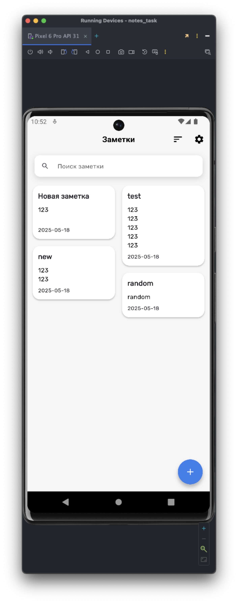  
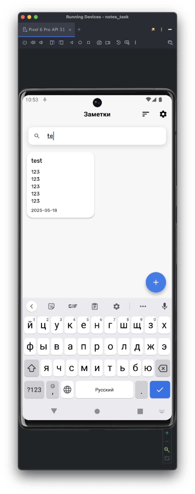  
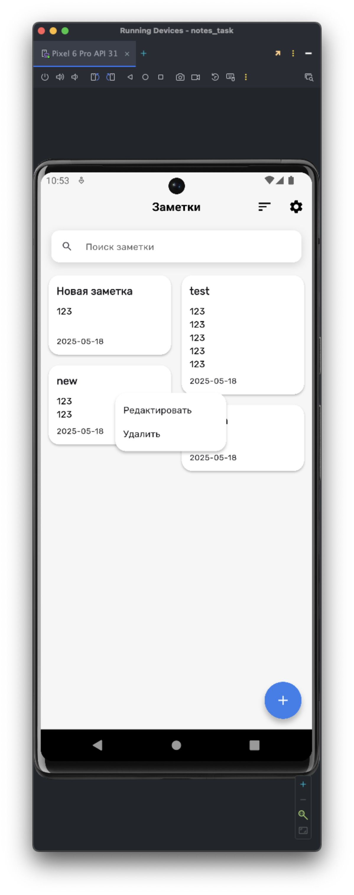  
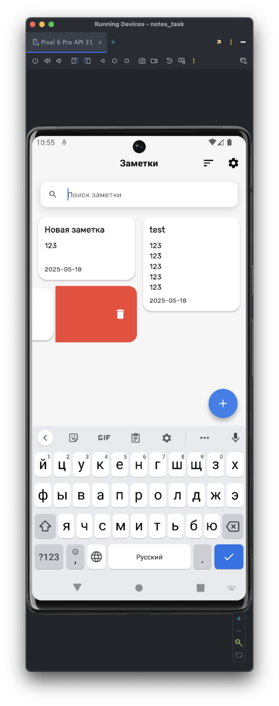  
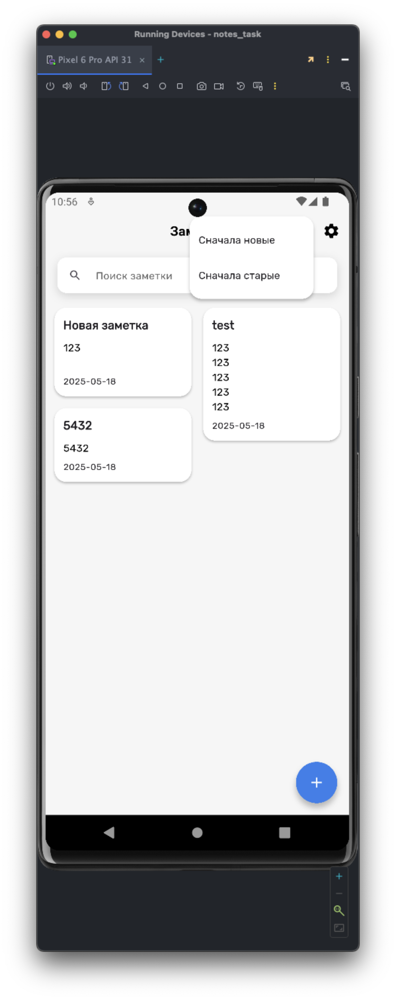  
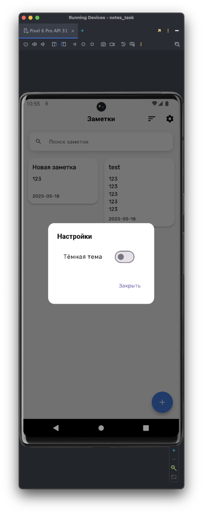  
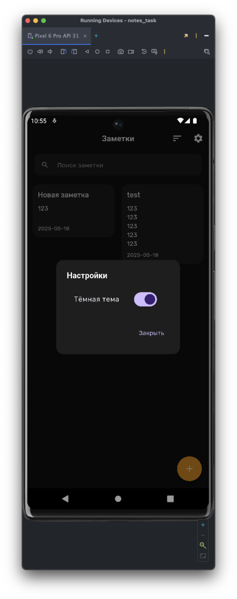  
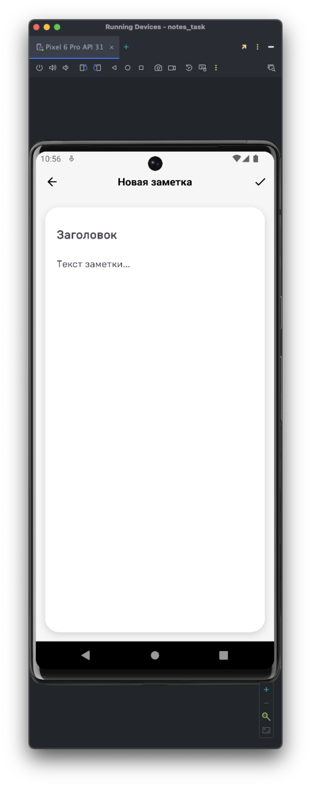  
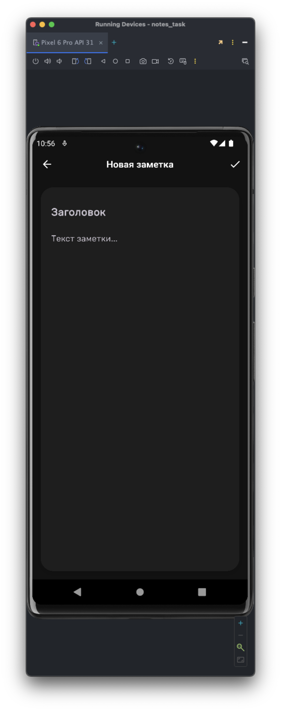  
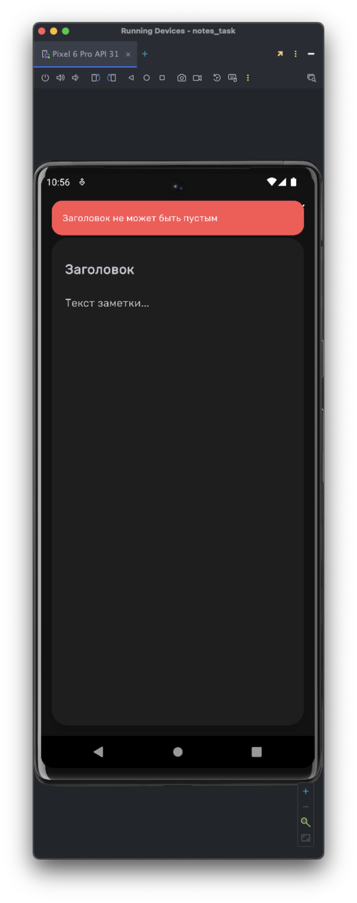  
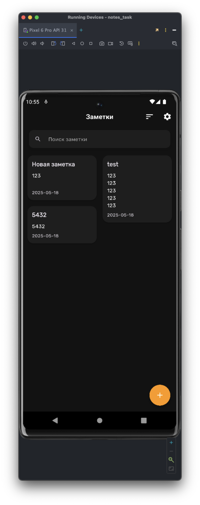  
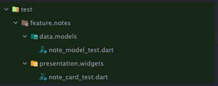
